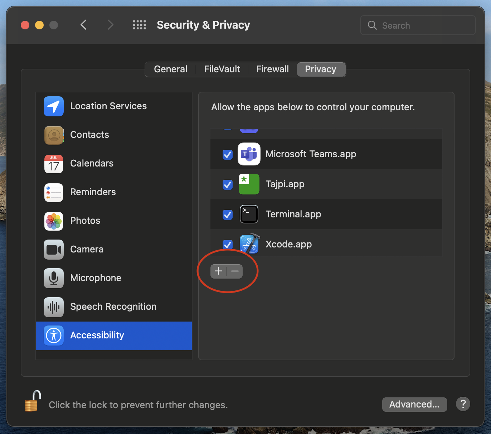

## Give access
After running the program you will need to open System Preferences and go to *Security & Privacy > Accessibility*. Click the lock in the bottom left to make changes. 

    

Click the + sign

    

Then find the location of the Application in the finder window and double click on it.

## Possible problems
Sometimes you'll need to remove Tajpi from the *Security & Privacy > Accessibility* menu and add it back again.

