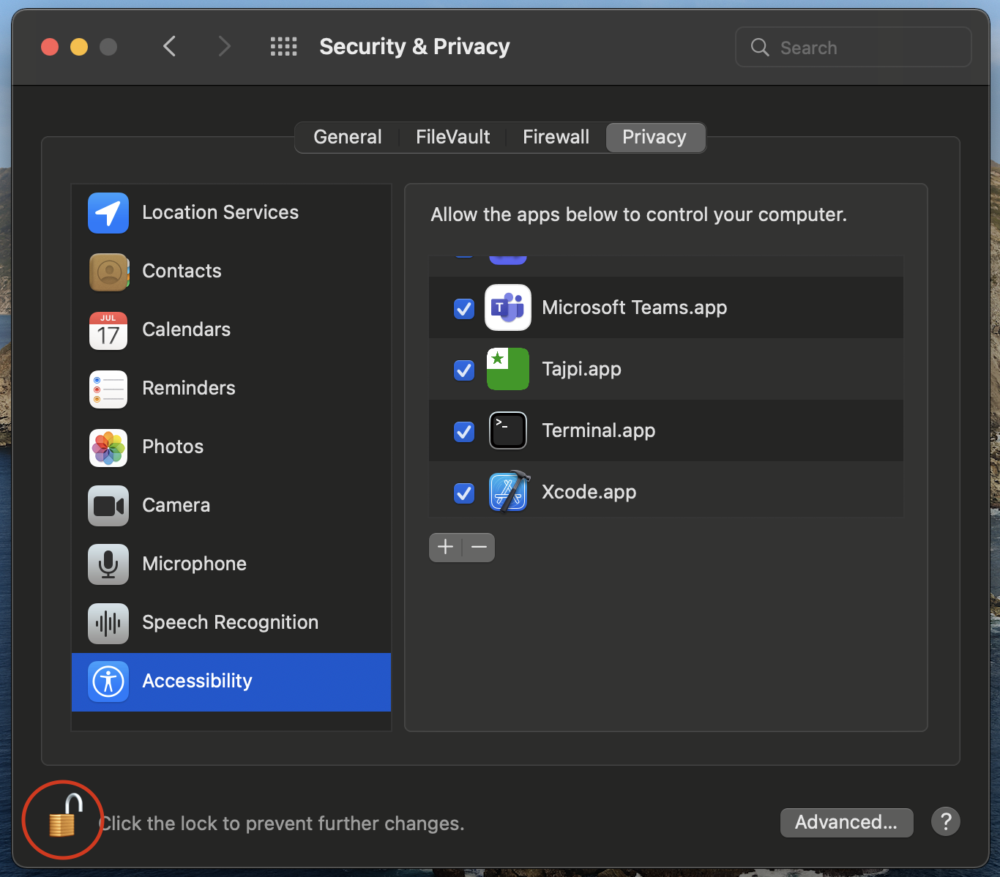
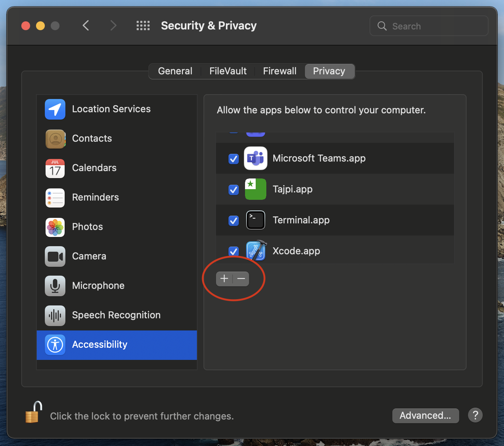
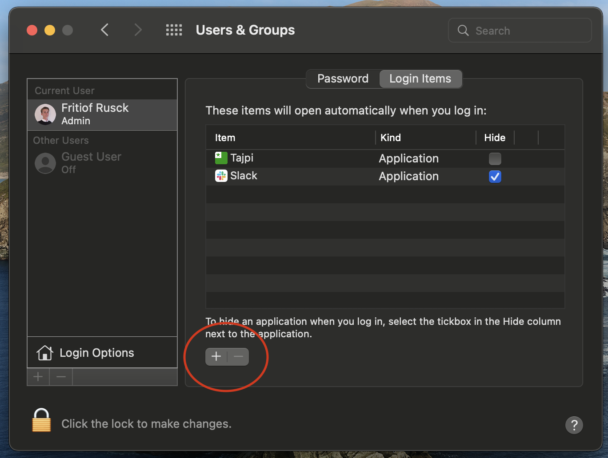

# Tajpi
A macos clone of the windows program [Tajpi](http://www.zz9pza.net/tajpi/en/) that lets you type esperanto letters by holding down the alt-gr key.

## Download
Download the [latest release](https://github.com/PumpedSardines/Tajpi/releases/tag/1.0.1) from this GitHub. To run this application you need to follow [these steps](https://support.apple.com/en-ph/guide/mac-help/mh40616/mac) for allowing execution. 
### Give Accessibility access
After running the program you will need to open System Preferences and go to *Security & Privacy > Accessibility*. Click the lock in the bottom left to make changes. 

    

Click the + sign

    

Then find the location of the Application in the finder window and double click on it.

### Launch on Startup
Some user might want Tajpi to always run. If that's the case you probably want to add it to autostart.

Open System Preferences and go to *Users & Groups > Login Items*. 
Click the plus sign button

    

Then find the location of the Application in the finder window and double click on it.

## How to use
Tajpi will appear as an icon in the menu bar. If you click on it, you'll be greeted with a settings interface. To type an esperanto letter press and hold the option key as you press down either c g h j s u and they will transform into ĉ ĝ ĥ ĵ ŝ ŭ
## Possible problems
Tajpi won't work without enabled accessability permissions. Double check that permissions are set. If you've downloaded a new version, you might need to remove tajpi from the list and add it again by pressing the "-" sign at the bottom left of the ui.
