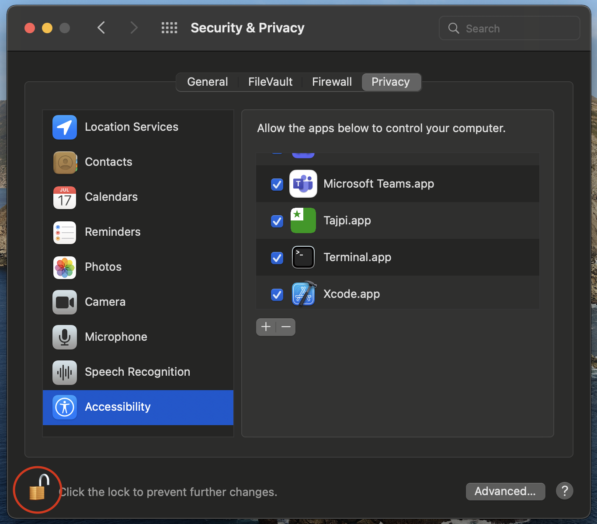
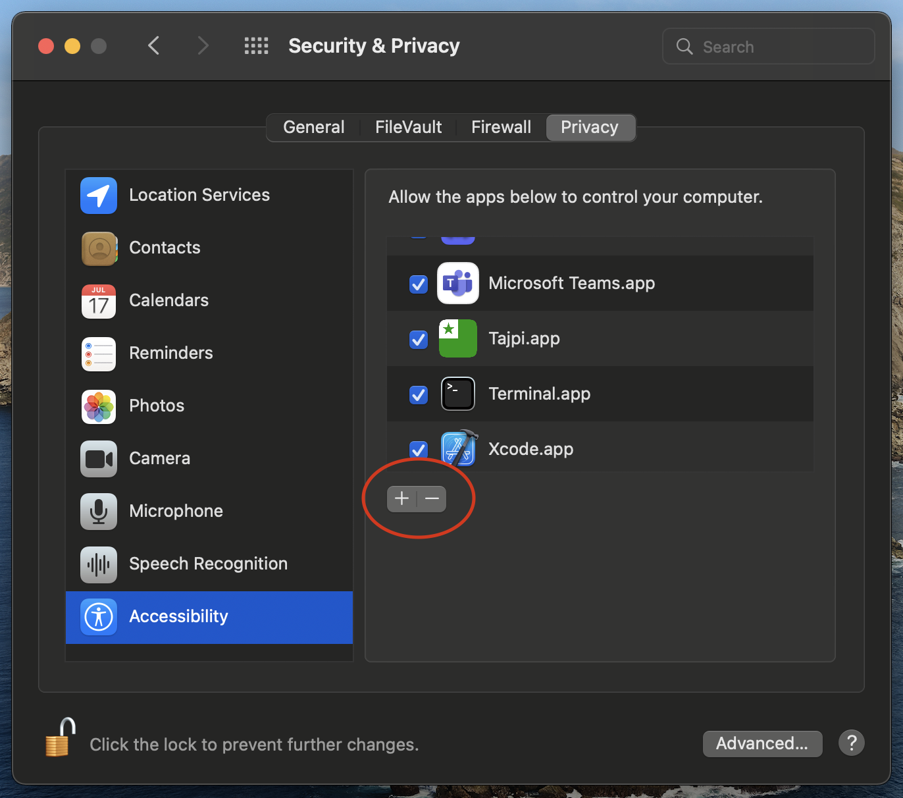
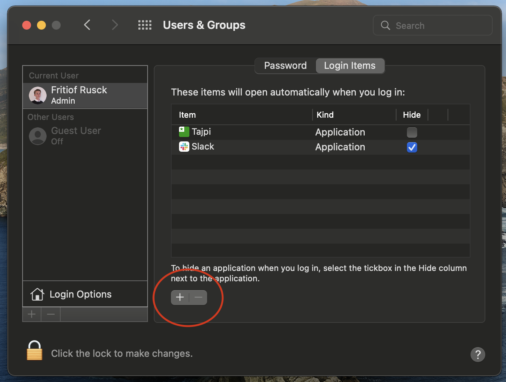

# Tajpi
A macos clone of the windows program [Tajpi](http://www.zz9pza.net/tajpi/en/). Tajpi lets you type esperanto letters by either holding down the option key or automatically transforming sh or sx combinations into corresponding Esperanto letter.
## Table of Contents

* [Download](#download)
    * [Give Accessibility access](#give-accessibility-access)
    * [Launch on Startup](#launch-on-startup)
* [How to use](#how-to-use)
    * [Modes](#modes)
* [Possible problems](#possible-problems)

## Download
Download the [latest release](https://github.com/PumpedSardines/Tajpi/releases/tag/1.1.0) from this GitHub. To run this application you need to follow [these steps](https://support.apple.com/en-ph/guide/mac-help/mh40616/mac) for allowing execution. 

### Give Accessibility access
After running the program you will need to open System Preferences and go to *Security & Privacy > Accessibility*. Click the lock in the bottom left to make changes. 

    

Click the + sign

    

Then find the location of the Application in the finder window and double click on it.

### Launch on Startup
Some user might want Tajpi to always run. If that's the case you probably want to add it to autostart.

Open System Preferences and go to *Users & Groups > Login Items*. 
Click the plus sign button

    

Then find the location of the Application in the finder window and double click on it.

## How to use
Tajpi will appear as an icon in the menu bar. If you click on it, you'll be greeted with a settings interface.

### Modes
There exists three modes for entering Esperanto letters. Any combination of them can be enabled at the same time.

**Mode 1**: To type an esperanto letter press and hold the option key as you press down either c g h j s u and they will transform into ĉ ĝ ĥ ĵ ŝ ŭ.

**Mode 2**: Tajpi will keep track of the letters you press and when it sees the combination of a latin letter which resembles an esperanto letter and x. It will automatically transform it into the corresponding esperanto letter. This is especially useful for people who are already used to typing Esperanto words with x. Example sx turns into ŝ

**Mode 3**: The same as mode 2 but with h instead of x

## Possible problems
Tajpi won't work without enabled accessability permissions. Double check that permissions are set. If you've downloaded a new version, you might need to remove tajpi from the list and add it again by pressing the "-" sign at the bottom left of the ui.
